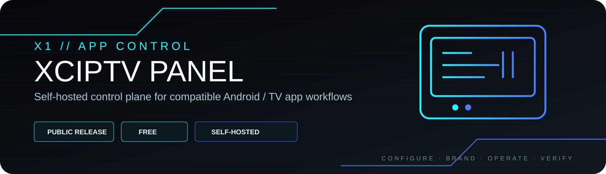
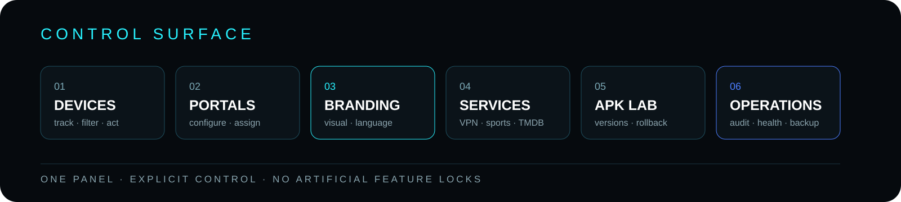
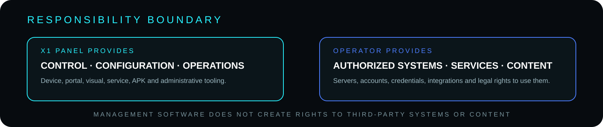

<p align="center">
  
</p>

<p align="center">
  <strong>PUBLIC · COMMUNITY · SELF-HOSTED</strong><br>
  Device control · Portals · Branding · Services · APK operations · Diagnostics
</p>

<p align="center">
  <a href="https://x1panel.space"><strong>WEBSITE</strong></a>
  &nbsp;·&nbsp;
  <a href="https://forum.x1panel.space"><strong>FORUM</strong></a>
  &nbsp;·&nbsp;
  <a href="https://discord.gg/vSSw6jHmw"><strong>DISCORD</strong></a>
  &nbsp;·&nbsp;
  <a href="https://t.me/+XkuQS_QuD6g4Nzc0"><strong>TELEGRAM</strong></a>
</p>

---

## X1 Panel XCIPTV

**X1 Panel v2.8.1 is a self-hosted administration and remote-configuration platform for compatible X1/XCIPTV application workflows.**

> **Free means functional.**
> The public release is intended to be useful as released.

The panel brings device management, portal configuration, visual control, VPN, Sports, TMDB, messaging, APK operations, backups, monitoring and administration into one operational surface.

---

<p align="center">
  
</p>

## What it controls

### Devices
Track connected devices, filter and manage them, apply per-device state, expiration, blocking and suspension, and use bulk operational actions where supported.

### Portals & application configuration
Configure up to five portals, manage application options and maintain the configuration expected by compatible client builds.

### Visual experience
Use the Home Editor, Feature Manager, visual profiles, theme controls and application-language settings to manage the application experience from the panel.

### External services
Configure supported VPN workflows, Sports providers and TMDB integration from the administration interface.

### APK operations
APK Lab provides application-delivery tooling, version tracking, upload history, Android validation guidance and rollback support.

### Operations & administration
The panel includes backup/restore, migration tooling, diagnostics, health checks, alerts, scheduled maintenance, API logging, administrative audit and role-based administration.

---

## Main capability set

- English and Portuguese administration interface
- Up to 5 configurable portals
- Visual Home Editor and Feature Manager
- Theme and application-language controls
- Device tracking, filters and bulk actions
- Per-device licenses, blocking, suspension and expiration
- Visual device profiles with inherit / enable / disable overrides
- VPN management
- Sports providers: TVSportGuide, TheSportsDB and custom iframe/URL
- TMDB integration
- Messages and global announcements
- APK Lab with delivery/callback tracking and Android validation checklist
- Direct APK upload, version history and rollback
- Backup / restore and Migration Assistant
- Diagnostics and Health Checks
- Alerts, notifications and operational tasks
- Scheduled maintenance
- API logs and administrative audit
- Owner / Admin / Operator / Read Only roles
- Optional 2FA / TOTP and administrator IP restrictions

---

## Operating model

`CONFIGURE` → `DELIVER` → `CONTROL` → `OBSERVE` → `VERIFY`

A setting being visible in the panel is not the same as the connected application proving that it consumed the setting correctly.

---

## Requirements

- PHP 8.1+
- OpenSSL
- Apache or Nginx
- HTTPS recommended
- Write permissions for required runtime directories

Optional migration functionality may require PHP SQLite3 and PHP ZIP.

---

## Installation / Quick Start

1. Download the latest X1 Panel package.
2. Extract it to your web server.
3. Open `install.php` in your browser.
4. Create the Owner account.
5. Sign in to X1 Panel.
6. Configure portals and application options.
7. Run X1 Diagnostics.
8. Validate the connected application on a real Android device before production use.

---

## Runtime truth / compatibility

The main compatibility endpoints are:

```text
api/ApiIPTV.php
api/CloudBackup.php
```

Do not rename them unless the compatible client application is updated accordingly.

Application behavior can differ between builds. Use APK Lab, diagnostics and a real Android test device to confirm which capabilities are supported by the specific build you operate.

Static presence of a setting in the panel does not prove that every third-party or historical application build consumes that setting at runtime.

---

<p align="center">
  
</p>

## Security / responsibility boundary

X1 Panel is management software. Operators remain responsible for the servers, applications, accounts, credentials, external services and content they configure through it, including having the necessary rights and authorization to use them.

For production deployments:

- use HTTPS;
- use a strong Owner password;
- enable 2FA where appropriate;
- keep PHP and the host updated;
- restrict administrator access where possible;
- protect backups and runtime data;
- review administrative audit logs;
- create a backup before major changes.

---

## Public X1 position

This repository belongs to the public X1 software family. Commercial X1 products exist separately and are not artificial unlocks for functionality intentionally removed from this project.

X1 also develops private commercial platforms and internal technology, but their architecture, infrastructure, security implementation and proprietary operational methods are not exposed through this repository.

---

## Related X1 systems

- [X1 GitHub](https://github.com/x1-dotcom)
- [X1 TiviMate Community](https://github.com/x1-dotcom/x1tivimate)
- [X1 Smarters V5](https://github.com/x1-dotcom/Smarters-V5)

---

## Community

- Website — https://x1panel.space
- Forum — https://forum.x1panel.space
- Discord — https://discord.gg/vSSw6jHmw
- Telegram — https://t.me/+XkuQS_QuD6g4Nzc0

---

<p align="center">
  <strong>CONFIGURE THE EXPERIENCE. CONTROL THE DEVICE. VERIFY THE RESULT.</strong><br><br>
  <strong>X1 // SOFTWARE · SYSTEMS · OPERATIONS</strong><br><br>
  PUBLIC SOFTWARE. PRIVATE ENGINEERING. ONE X1 IDENTITY.<br><br>
  <strong>© X1Tech Solutions SA · All Rights Reserved</strong>
</p>
